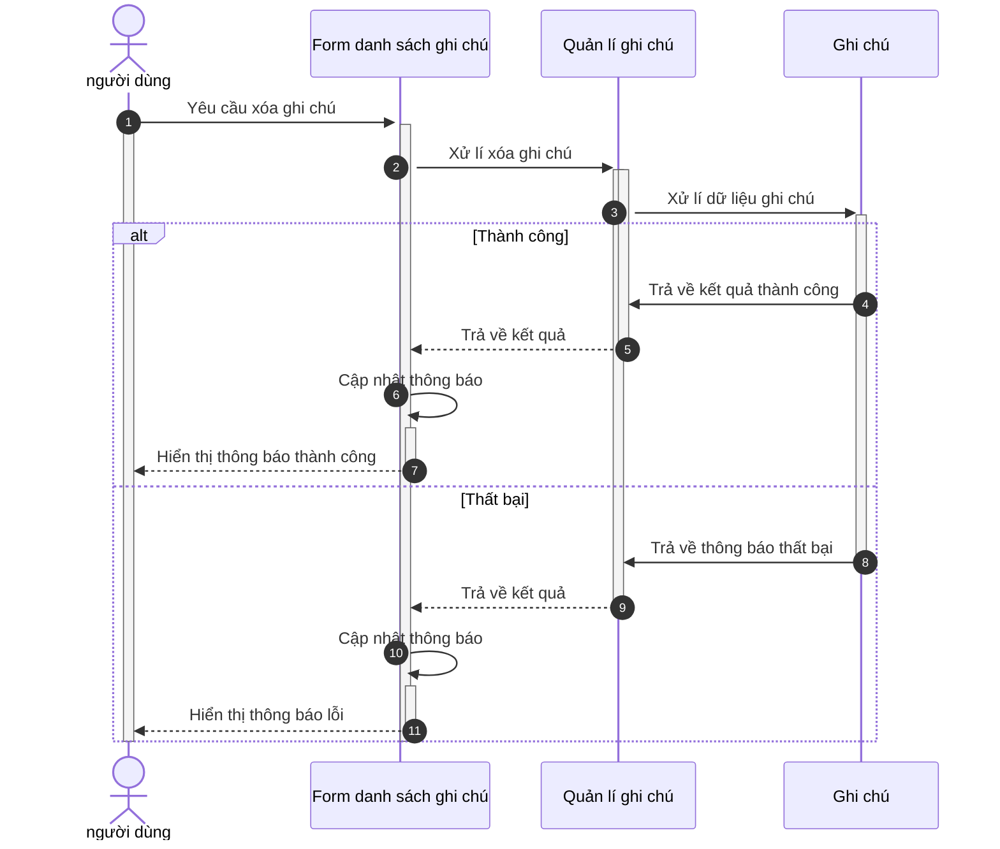

```mermaid
sequenceDiagram
actor user as người dùng
participant ui as Form danh sách ghi chú
participant manage as Quản lí ghi chú
participant db as Ghi chú
autonumber

user->>+ui: Yêu cầu xóa ghi chú
activate user
activate ui
ui->>+manage: Xử lí xóa ghi chú
activate manage
manage->>+db: Xử lí dữ liệu ghi chú
alt Thành công
db->>manage:Trả về kết quả thành công
manage-->>-ui:Trả về kết quả
ui->>+ui: Cập nhật thông báo
ui-->>-user: Hiển thị thông báo thành công
else Thất bại
db->>-manage:Trả về thông báo thất bại
manage-->>-ui:Trả về kết quả
ui->>+ui: Cập nhật thông báo
ui-->>-user: Hiển thị thông báo lỗi
end
deactivate ui
deactivate user

```
