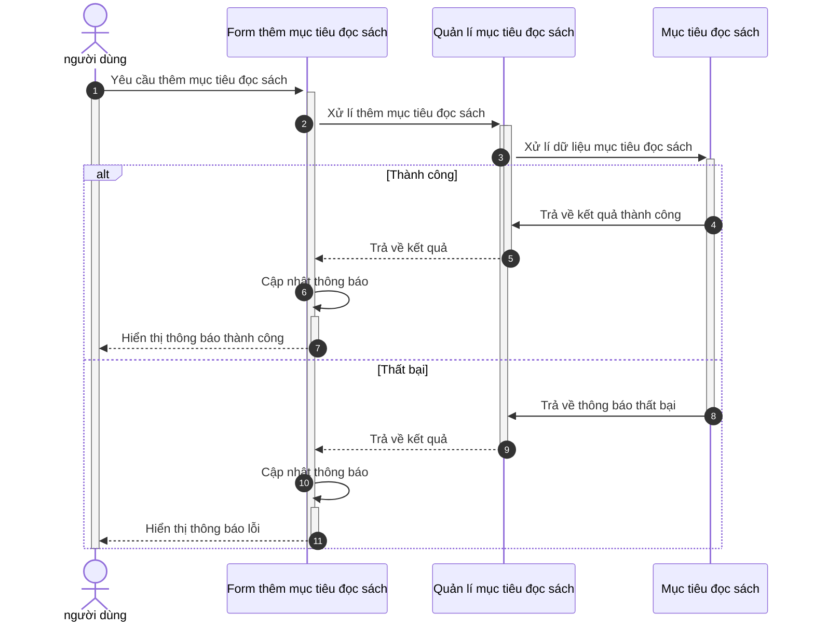

```mermaid
sequenceDiagram
actor user as người dùng
participant ui as Form thêm mục tiêu đọc sách
participant manage as Quản lí mục tiêu đọc sách
participant db as Mục tiêu đọc sách
autonumber

user->>+ui: Yêu cầu thêm mục tiêu đọc sách
activate user
activate ui
ui->>+manage: Xử lí thêm mục tiêu đọc sách
activate manage
manage->>+db: Xử lí dữ liệu mục tiêu đọc sách
alt Thành công
db->>manage:Trả về kết quả thành công
manage-->>-ui:Trả về kết quả
ui->>+ui: Cập nhật thông báo
ui-->>-user: Hiển thị thông báo thành công
else Thất bại
db->>-manage:Trả về thông báo thất bại
manage-->>-ui:Trả về kết quả
ui->>+ui: Cập nhật thông báo
ui-->>-user: Hiển thị thông báo lỗi
end
deactivate ui
deactivate user

```
