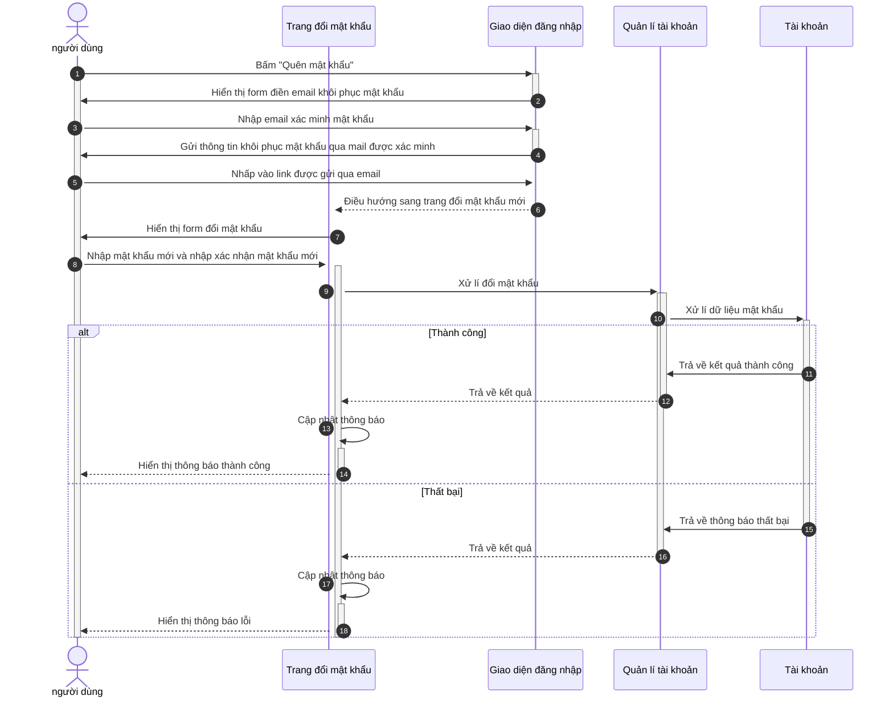

```mermaid
sequenceDiagram
actor user as người dùng
participant ui as Trang đổi mật khẩu
participant ui2 as Giao diện đăng nhập
participant manage as Quản lí tài khoản
participant db as Tài khoản
autonumber

user->>+ui2: Bấm "Quên mật khẩu"
activate user
activate ui
ui2->>-user: Hiển thị form điền email khôi phục mật khẩu
user->>+ui2: Nhập email xác minh mật khẩu
ui2->>-user: Gửi thông tin khôi phục mật khẩu qua mail được xác minh
user->>+ui2: Nhấp vào link được gửi qua email
activate ui
ui2-->>+ui: Điều hướng sang trang đổi mật khẩu mới
ui->>user: Hiển thị form đổi mật khẩu
user->>+ui: Nhập mật khẩu mới và nhập xác nhận mật khẩu mới
ui->>+manage: Xử lí đổi mật khẩu
activate manage
manage->>+db: Xử lí dữ liệu mật khẩu
alt Thành công
db->>manage:Trả về kết quả thành công
manage-->>-ui:Trả về kết quả
ui->>+ui: Cập nhật thông báo
ui-->>-user: Hiển thị thông báo thành công
else Thất bại
db->>-manage:Trả về thông báo thất bại
manage-->>-ui:Trả về kết quả
ui->>+ui: Cập nhật thông báo
ui-->>-user: Hiển thị thông báo lỗi
end
deactivate ui
deactivate user

```
