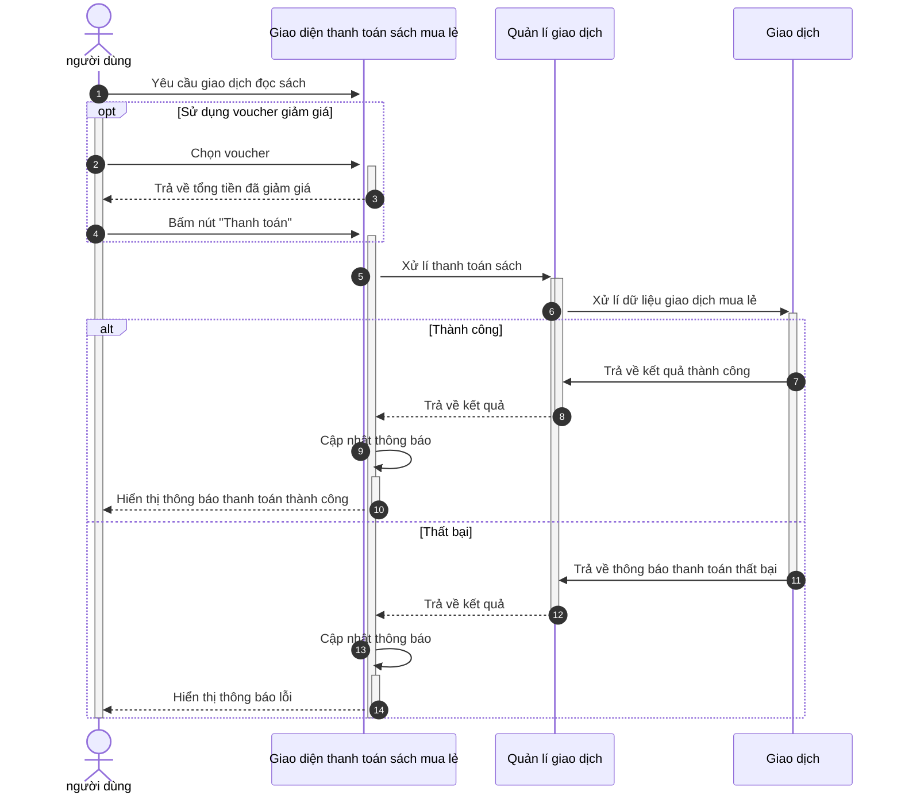

```mermaid
sequenceDiagram
actor user as người dùng
participant ui as Giao diện thanh toán sách mua lẻ
participant manage as Quản lí giao dịch
participant db as Giao dịch
autonumber

user->>+ui: Yêu cầu giao dịch đọc sách
activate user
activate ui
opt Sử dụng voucher giảm giá
user->>+ui: Chọn voucher
ui-->>-user: Trả về tổng tiền đã giảm giá
user->>+ui: Bấm nút "Thanh toán"
end
ui->>+manage: Xử lí thanh toán sách
activate manage
manage->>+db: Xử lí dữ liệu giao dịch mua lẻ
alt Thành công
db->>manage:Trả về kết quả thành công
manage-->>-ui:Trả về kết quả
ui->>+ui: Cập nhật thông báo
ui-->>-user: Hiển thị thông báo thanh toán thành công
else Thất bại
db->>-manage:Trả về thông báo thanh toán thất bại
manage-->>-ui:Trả về kết quả
ui->>+ui: Cập nhật thông báo
ui-->>-user: Hiển thị thông báo lỗi
end
deactivate ui
deactivate user

```
